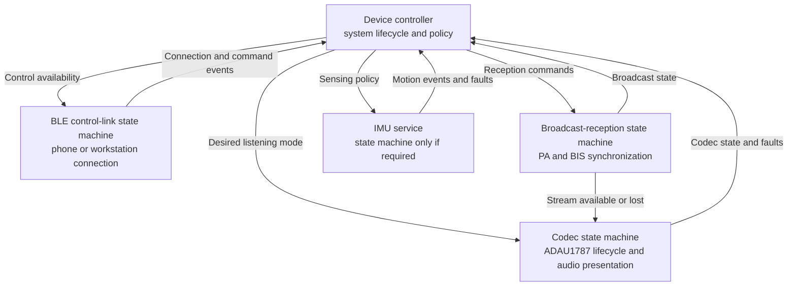
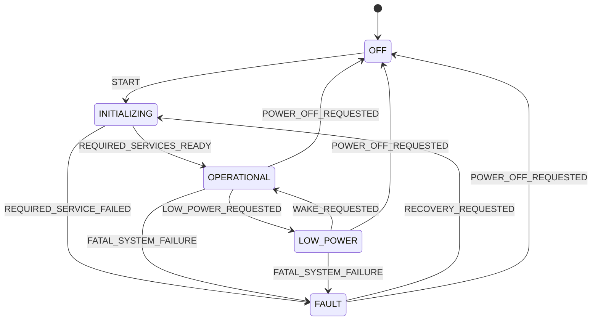
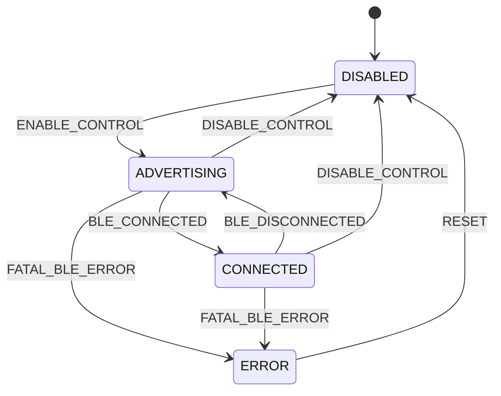
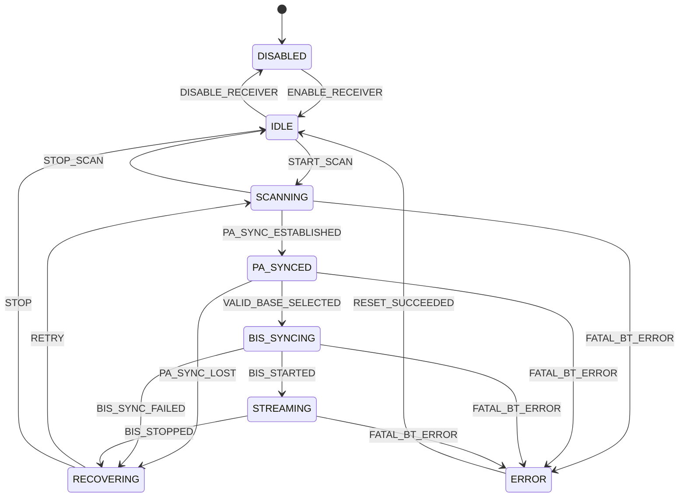
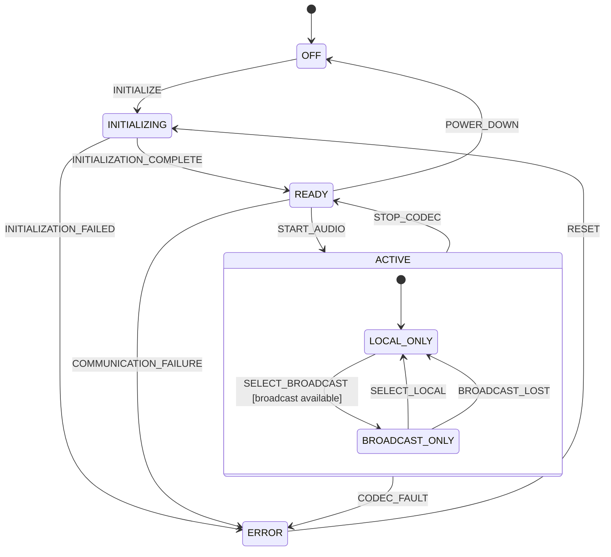
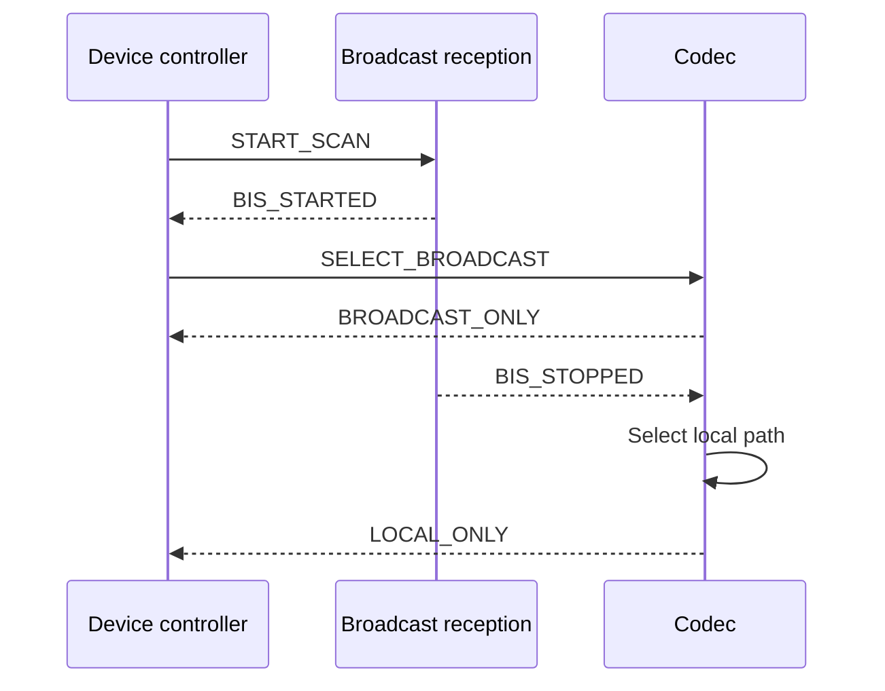

# Tiresias Firmware Control Plane

## Purpose

The Tiresias firmware uses an event-driven control plane to coordinate changes in device
behavior. It is organized as a supervisory device controller and a set of cooperating
subsystem state machines.

This architecture is best described as a **network of communicating finite-state
machines**. It is not one monolithic hierarchical state machine: each subsystem owns an
independent semantic dimension and can be in a state at the same time as the others.
Hierarchy may still be used inside an individual machine where several states share common
behavior.

The architectural layers and the control/data-plane distinction describe different views
of the firmware:

- The application, module, and driver layers describe dependencies and abstraction.
- The control plane describes decisions, commands, events, and state reporting.
- The audio data plane transports time-critical ISO, LC3, PCM, and I2S data.

Consequently, the control plane occupies much of the application layer but also interacts
with services in the module layer.

## Overview



The arrows carry control-plane information, not audio frames. Broadcast ISO packets, LC3
frames, decoded samples, and I2S buffers remain in dedicated callbacks, FIFOs, and fixed
buffers.

## State-machine ownership

| State machine | Semantic question it answers |
|---|---|
| Device controller | Is the device starting, operational, conserving power, or in a fatal fault? |
| BLE control link | Can the phone or workstation exchange control information with the device? |
| Broadcast reception | What is the device's synchronization relationship with an LE Audio broadcaster? |
| Codec | What is the ADAU1787's operational condition, and what audio is it presenting? |

Each machine changes only its own state. It requests work from another subsystem using a
command and receives completion, state, or fault events in response. The device controller
coordinates system-wide policy but does not directly manipulate codec registers, Bluetooth
procedures, or audio buffers.

## 1. Device controller

### Why it exists

The device controller is the high-level supervisor originally represented as the
application `Controller`. It provides one authoritative view of whole-device availability,
starts services in the required order, coordinates operations that involve several
subsystems, and handles failures that prevent continued operation.

Calling it a *controller* or *supervisor* is preferable to *master*: it requests desired
behavior from subsystem owners rather than implementing their procedures.

### Semantic responsibility

The controller represents the lifecycle of the complete device. It must not duplicate
detailed Bluetooth or audio states. For example, broadcast reception can be `STREAMING`
while the device controller remains `OPERATIONAL`.

| State | Meaning |
|---|---|
| `OFF` | Application services and active audio paths are stopped. |
| `INITIALIZING` | Required subsystems are becoming ready. |
| `OPERATIONAL` | Required services are ready and normal operation is permitted. |
| `LOW_POWER` | Nonessential services and active audio paths are suspended to conserve power. |
| `FAULT` | A device-level invariant or required service has failed irrecoverably. |



High-level operating modes should be added only when they change system-wide policy.
Duplicating `BROADCAST_ONLY` in the controller merely to mirror the codec machine would
create two owners for the same fact.

## 2. BLE control-link state machine

### Why it exists

The bidirectional BLE connection to the companion application or research workstation is
independent of LE Audio broadcast reception. It can connect, disconnect, or fail without
changing the broadcast synchronization state.

### Semantic responsibility

This machine owns connectable advertising, the BLE connection lifecycle, and availability
of the custom control service. It receives control messages, but the subsystem that owns a
requested behavior validates and executes the command.

| State | Meaning |
|---|---|
| `DISABLED` | The control link is unavailable. |
| `ADVERTISING` | The device is accepting control-link connection requests. |
| `CONNECTED` | A BLE connection exists and the custom control service is available. |
| `ERROR` | The control-link subsystem cannot continue without recovery. |



Individual GATT reads, writes, and notifications normally remain events or actions within
`CONNECTED`; they are not persistent states.

## 3. Broadcast-reception state machine

### Why it exists

LE Audio broadcast reception is a multi-stage asynchronous procedure. Scanning, periodic
advertising synchronization, BASE selection, BIG/BIS synchronization, streaming, and
recovery cannot be represented accurately by the control-link state machine.

### Semantic responsibility

This machine owns discovery and synchronization with a broadcast source. It reports
whether broadcast data is available but does not decide whether the user should hear it.

| State | Meaning |
|---|---|
| `DISABLED` | Broadcast reception is unavailable. |
| `IDLE` | The receiver is initialized but not searching. |
| `SCANNING` | The device is searching for a suitable source. |
| `PA_SYNCED` | Periodic advertising synchronization is established. |
| `BIS_SYNCING` | BIG/BIS synchronization is being established. |
| `STREAMING` | ISO data is being received from the selected BIS. |
| `RECOVERING` | A recoverable synchronization failure is being cleaned up. |
| `ERROR` | Reception cannot continue without external recovery. |



The two Bluetooth machines are orthogonal. A valid simultaneous condition is:

```text
BLE control link:     CONNECTED
Broadcast reception:  STREAMING
```

## 4. Codec state machine

### Why it exists

The ADAU1787 has a meaningful lifecycle: reset and initialization, signal-path selection,
parameter updates, power-down, and communication failure. It also contains the microphone
inputs, DSP, broadcast input, and analog output. The codec is therefore the component that
ultimately determines what the user hears.

A dedicated owner prevents unrelated modules from issuing uncoordinated I2C transactions
or maintaining conflicting views of codec readiness and audible presentation.

### Semantic responsibility

The codec machine represents both the operational condition of the physical ADAU1787 and
its active audio path. At this initial implementation stage, it owns local-only and
broadcast-only presentation. It does not manage Bluetooth synchronization or transport
audio frames.

| State | Meaning |
|---|---|
| `OFF` | The codec is powered down or not initialized. |
| `INITIALIZING` | Reset, boot, and initial programming are in progress. |
| `READY` | The codec is configured and available but not presenting audio. |
| `ACTIVE` | Parent state for modes in which the codec presents audio. |
| `LOCAL_ONLY` | The local microphone and DSP path is presented at the analog output. |
| `BROADCAST_ONLY` | The received broadcast path is presented at the analog output. |
| `ERROR` | Initialization or communication failed. |



`ACTIVE` is a hierarchical parent state. Its substates express what reaches the analog
output, while transitions defined on `ACTIVE`, such as `STOP_CODEC` or `CODEC_FAULT`, apply
to every presentation mode.

Codec configuration and parameter operations are short and synchronous at this stage.
They are handled as transition actions or events within `READY` or the current `ACTIVE`
substate rather than being modeled as a persistent state.

## Coordination example

The following sequence illustrates how responsibility remains separated when broadcast
audio is selected:



This is a command-and-report relationship:

- The controller requests a desired high-level behavior.
- The owning subsystem determines the detailed transition sequence.
- The subsystem reports completion or failure.
- The controller does not write another machine's state directly.

## IMU and simple services

Not every module requires a state machine. The IMU may need one if calibration, operating
modes, or recovery create meaningful persistent conditions such as:

```text
OFF -> INITIALIZING -> CALIBRATING -> TRACKING -> ERROR
```

If it initializes once and periodically publishes samples, a conventional service with
initialization, sampling, and error reporting is simpler. Storage, LEDs, and buttons
similarly do not require state machines unless their behavior gains a genuine asynchronous
lifecycle.

## Hierarchy

The overall architecture is not a single hierarchical state machine because the subsystem
states coexist rather than nest. For example:

```text
Device controller:     OPERATIONAL
BLE control link:      CONNECTED
Broadcast reception:   STREAMING
Codec:                 ACTIVE / BROADCAST_ONLY
```

Hierarchy can still reduce repetition inside one subsystem. The broadcast states `IDLE`,
`SCANNING`, `PA_SYNCED`, `BIS_SYNCING`, and `STREAMING` could be nested within a common
`ENABLED` parent. A transition such as `DISABLE_RECEIVER` could then be defined once on the
parent instead of repeated for every child state.

The recommended classification is therefore:

> A supervisory event-driven control plane composed of cooperating finite-state machines,
> with hierarchical states used locally where they simplify shared behavior.

## Execution model

State-machine transitions operate on low-rate control information:

- Commands express requested behavior, such as `START_SCAN` or `SELECT_BROADCAST`.
- Events describe occurrences, such as `BIS_STARTED` or `CODEC_FAULT`.
- State reports describe durable conditions, such as `STREAMING` or `BROADCAST_ONLY`.

Zephyr Zbus is suitable for these commands, events, and reports. Interrupt and Bluetooth
callbacks should capture the required information, enqueue or publish an event, and return.
Blocking I2C transactions and longer operations should run in the owning service thread or
work queue.

The audio data plane remains separate:

| Information | Transport |
|---|---|
| Commands, events, and state reports | Zbus channels or service queues |
| Bluetooth ISO SDUs and LC3 frames | Dedicated FIFOs |
| PCM and I2S blocks | Fixed buffers and real-time callbacks |
| High-rate IMU samples | Dedicated sensor queue or buffer if required |

## Scope boundaries

FOTA does not require an application-owned state machine. Image transfer, validation, boot
selection, and rollback are provided by the Zephyr and NCS update infrastructure.

Battery monitoring is omitted at this development stage. On the current Tiresias DK
hardware revision, the battery-monitoring signal is connected to a digital-only nRF5340
GPIO and cannot be sampled by the SAADC.

## Relationship to the current implementation

| Current component | Current behavior | Architectural direction |
|---|---|---|
| Application controller | Maintains the overall `OFF`, `INITIALIZING`, `STANDARD`, `BROADCAST_STREAMING`, and `ERROR` states | Becomes a lifecycle supervisor and stops mirroring detailed codec presentation mode. |
| Bluetooth service | Maintains `OFF`, `INITIALIZING`, `READY`, and `ERROR` | Separates control-link lifecycle from broadcast-reception lifecycle. |
| Audio control | Maintains `OFF`, `INITIALIZING`, `STANDARD`, `BROADCAST_STREAMING`, and `ERROR` | Evolves into the codec-owned lifecycle and presentation state machine. |
| ADAU1787 control | Performs codec programming and parameter operations | Becomes the implementation behind the codec state machine; short synchronous configuration operations remain actions rather than states. |
| Zbus channels | Carry commands, state reports, button events, and LE Audio lifecycle events | Remain the principal control-plane communication mechanism. |
| LE Audio RX and audio datapath | Use FIFOs, LC3 decoding, timing compensation, and I2S buffering | Remain in the data plane rather than becoming state-machine event traffic. |

The decomposition should be introduced incrementally. A state should correspond to a real,
observable semantic condition, not merely a function that happens to execute.
