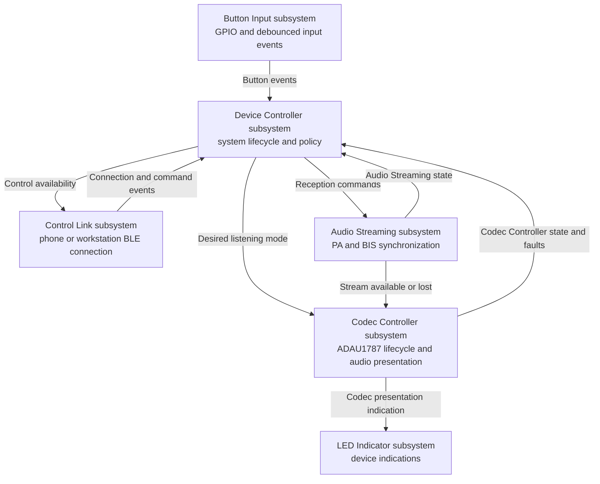
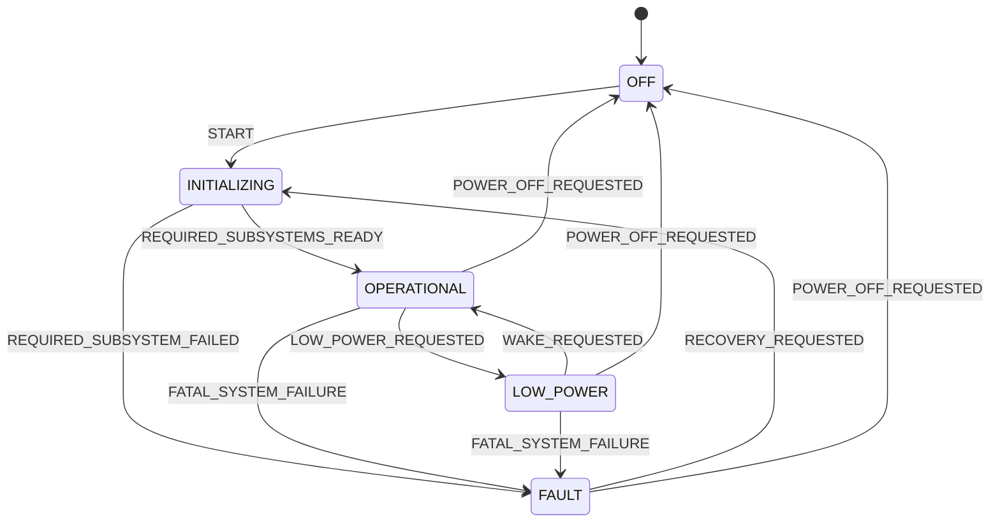
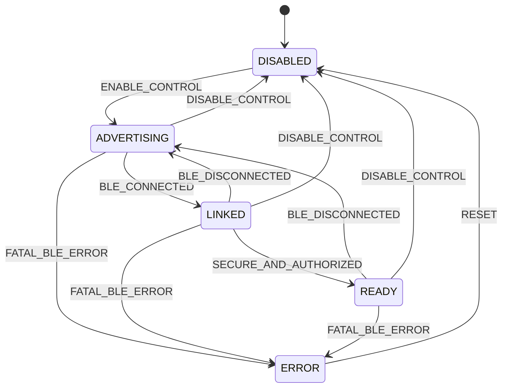
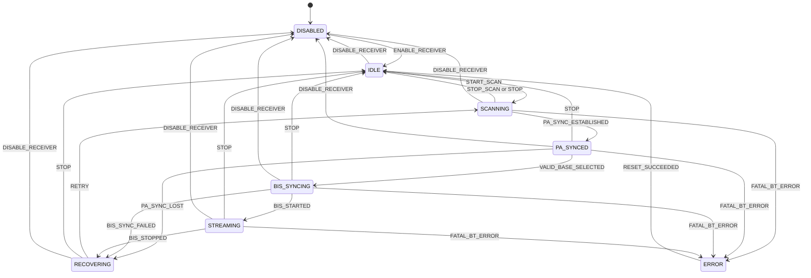
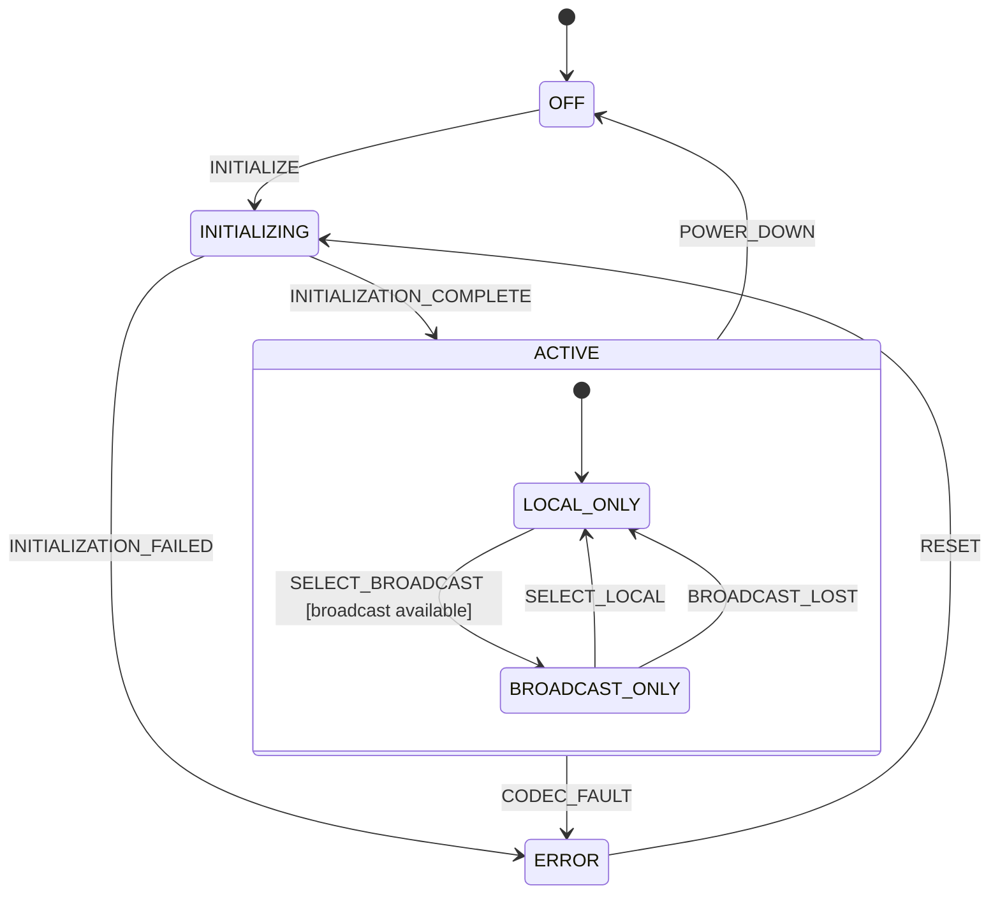
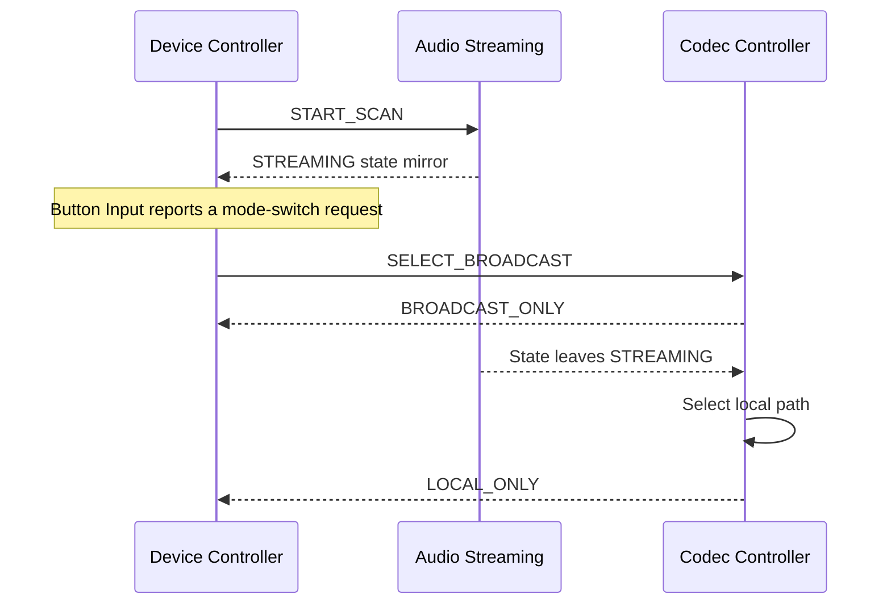

# Tiresias Firmware Control Plane

## Purpose

The Tiresias firmware uses an event-driven control plane to coordinate changes in device
behavior. It is organized as a supervisory Device Controller subsystem and a set of
cooperating subsystems.

This architecture is best described as a **network of communicating finite-state
machines**. It is not one monolithic hierarchical state machine: each stateful subsystem
owns an independent semantic dimension and can be in a state at the same time as the
others. Hierarchy may still be used inside an individual machine where several states share
common behavior.

The architectural layers and the control/data-plane distinction describe different views
of the firmware:

- The application, module, and driver layers describe dependencies and abstraction.
- The control plane describes decisions, commands, events, and state reporting.
- The audio data plane transports time-critical ISO, LC3, PCM, and I2S data.

Consequently, the control plane occupies much of the application layer but also includes
subsystems implemented in the module layer.

## Overview



The arrows carry control-plane information, not audio frames. Broadcast ISO packets, LC3
frames, decoded samples, and I2S buffers remain in dedicated callbacks, FIFOs, and fixed
buffers.

## Subsystem naming and ownership

Every active control-plane owner is called a **subsystem**. A subsystem may own a state
machine, consume Zbus messages through a subscriber, publish semantic events, or combine
these roles. State machines and subscribers are implementation mechanisms owned by a
subsystem; they are not independently named architectural components.

The canonical subsystem names are `Device Controller`, `Control Link`, `Audio Streaming`,
`Codec Controller`, `Button Input`, and `LED Indicator`. Prose uses the form *Device
Controller subsystem*; diagrams and tables may use the canonical name alone when their
context already identifies the entries as subsystems.

The four stateful subsystems answer independent semantic questions:

| Stateful subsystem | Semantic question it answers |
|---|---|
| Device Controller | Is the device starting, operational, conserving power, or in a fatal fault? |
| Control Link | What is the availability of the incoming BLE link and an authorized Tiresias control session? |
| Audio Streaming | What is the device's synchronization relationship with an LE Audio broadcaster? |
| Codec Controller | What is the ADAU1787's operational condition, and what audio is it presenting? |

Each stateful subsystem changes only its own state. It requests work from another subsystem
using a command and receives completion, state, or fault events in response. The Device
Controller subsystem coordinates system-wide policy but does not directly manipulate codec
registers, Bluetooth procedures, or audio buffers.

### State-centric model

All state machines are **state-centric**. Each stateful subsystem keeps its authoritative
current state in private internal storage. Command and event handlers evaluate that private
state, perform a valid transition, and then publish the new value to the subsystem's Zbus
state channel.

The Zbus state channel is a read-only mirror for the rest of the control plane; it is not the
state machine's backing store or a shared variable through which another subsystem can
change state. Only the owning subsystem publishes to its state channel. Other subsystems
observe the channel for transitions or read its latest value as a snapshot.

The private state and channel mirror must start with the same initial value:

| Subsystem | Initial private state and channel value |
|---|---|
| Device Controller | `OFF` |
| Control Link | `DISABLED` |
| Audio Streaming | `DISABLED` |
| Codec Controller | `OFF` |

A transition helper should be the single internal path for changing state. It updates the
private state and publishes the mirror only after the transition has been accepted. If
publication fails, the private state remains authoritative and the owning subsystem handles
the stale mirror as a reporting failure rather than recovering state by reading the channel.

### Initial command-progress model

The first implementation uses optimistic commands with authoritative state reports. A
publisher requests an operation once and assumes that the receiving subsystem accepted it
and uses state-channel notifications to determine when initialization or a lifecycle
transition has completed. The Device Controller reads the latest state snapshots when it
handles a notification; it does not maintain separate cached copies.

This initial model intentionally does not maintain per-subsystem outstanding-command
records or correlate every result with stored command metadata. A single lifecycle target
or phase may be retained when the Device Controller must wait for several subsystem states,
but the subsystem state channels remain the source of completion information.

Commands that request a terminal condition own their internal sequence. For example,
`POWER_DOWN` tells the Codec Controller to stop presentation if necessary and reach `OFF`;
`STOP` tells Audio Streaming to stop any active reception procedure and reach `IDLE`; and
`DISABLE_RECEIVER` tells Audio Streaming to stop any active procedure, clean up, and reach
`DISABLED`. This avoids publishing multiple commands back-to-back on the same latest-value
Zbus channel.

Future reliability guardrails are deferred until the control flow is stable. They include
per-destination outstanding-command tracking, command/result correlation, stale-result
detection, deadlines, retries, and escalation policies.

## 1. Device Controller subsystem

### Why it exists

The Device Controller subsystem is the high-level supervisor originally represented by the
application `Controller` implementation. It provides one authoritative view of whole-device
availability, starts subsystems in the required order, coordinates operations that involve
several subsystems, and handles failures that prevent continued operation.

Calling this subsystem a *controller* or *supervisor* is preferable to *master*: it requests
desired behavior from other subsystem owners rather than implementing their procedures.

### Semantic responsibility

The Device Controller subsystem represents the lifecycle of the complete device. It must
not duplicate detailed Bluetooth or audio states. For example, the Audio Streaming
subsystem can be `STREAMING` while the Device Controller subsystem remains `OPERATIONAL`.

| State | Meaning |
|---|---|
| `OFF` | Application subsystems and active audio paths are stopped. |
| `INITIALIZING` | Required subsystems are becoming ready. |
| `OPERATIONAL` | Required subsystems are ready and normal operation is permitted. |
| `LOW_POWER` | Nonessential subsystems and active audio paths are suspended to conserve power. |
| `FAULT` | A device-level invariant or required subsystem has failed irrecoverably. |



High-level operating modes should be added only when they change system-wide policy.
Duplicating `BROADCAST_ONLY` in the Device Controller subsystem merely to mirror the Codec
Controller subsystem would create two owners for the same fact.

The initial PoC implements `START`, initialization, `OPERATIONAL`, and `FAULT`. Low-power,
power-off, wake, and recovery transitions remain reserved by the model.

## 2. Control Link subsystem

### Why it exists

The Control Link subsystem owns the bidirectional BLE remote-management session with the
companion application or research workstation. It is independent of the Audio Streaming
subsystem and can connect, disconnect, or fail without changing broadcast synchronization
state. Bluetooth stack initialization and physical controller resources are shared
platform concerns rather than state owned by either subsystem.

### Semantic responsibility

This subsystem owns the policy and lifecycle for control availability, retains the selected
peer, negotiates and authorizes the vendor protocol session, and translates remote requests
into semantic internal operations. The shared Bluetooth Management module performs the
physical advertising and connection procedures. The subsystem that owns requested device,
broadcast, or codec behavior remains responsible for final validation and execution.

| State | Meaning |
|---|---|
| `DISABLED` | The Control Link subsystem is unavailable. |
| `ADVERTISING` | The subsystem is accepting BLE connection requests. |
| `LINKED` | An ACL connection exists, but an authorized Tiresias custom-protocol session is not yet ready. Standard services remain available according to their permissions. |
| `READY` | The peer is secure and authorized, protocol negotiation is complete, and the Tiresias custom service can exchange requests and responses. |
| `ERROR` | The Control Link subsystem cannot continue without recovery. |



Individual GATT reads, writes, and notifications normally remain events or actions within
`READY`; they are not persistent states. Remote request rejection does not enter `ERROR`.
The `LINKED` distinction also permits a Broadcast Assistant to use the standardized BASS
interface without opening the vendor-specific Tiresias protocol.

The Control Link foundation initializes the shared Bluetooth stack, starts connectable
advertising, exposes the standard read-only Device Information Service, tracks the
physical ACL, restarts advertising after disconnection, and drives LED 1. Its `CONNECTED`
state must evolve to the target `LINKED`/`READY` semantics, or an equivalent internal
session distinction, before the custom Tiresias GATT service accepts writes. The complete
conceptual design is in [control-link.md](control-link.md).

## 3. Audio Streaming subsystem

### Why it exists

The Audio Streaming subsystem performs a multi-stage asynchronous procedure. Scanning,
periodic advertising synchronization, BASE selection, BIG/BIS synchronization, streaming,
and recovery cannot be represented accurately by the Control Link subsystem.

### Semantic responsibility

The Audio Streaming subsystem owns discovery and synchronization with a broadcast
source. It reports whether broadcast data is available but does not decide whether the user
should hear it.

| State | Meaning |
|---|---|
| `DISABLED` | The Audio Streaming subsystem is unavailable. |
| `IDLE` | The receiver is initialized but not searching. |
| `SCANNING` | The device is searching for a suitable source. |
| `PA_SYNCED` | Periodic advertising synchronization is established. |
| `BIS_SYNCING` | BIG/BIS synchronization is being established. |
| `STREAMING` | ISO data is being received from the selected BIS. |
| `RECOVERING` | A recoverable synchronization failure is being cleaned up. |
| `ERROR` | Reception cannot continue without external recovery. |



The two Bluetooth subsystems are orthogonal. A valid simultaneous condition is:

```text
Control Link:         READY
Audio Streaming:      STREAMING
```

For the initial PoC, `START_SCAN` from `DISABLED` performs receiver initialization and
starts scanning in one action. Stream or synchronization loss is cleaned up and returns
directly to `SCANNING`; the explicit `RECOVERING` state and the enable/disable/reset command
paths remain reserved for a later implementation stage.

## 4. Codec Controller subsystem

### Why it exists

The ADAU1787 has a meaningful lifecycle: reset and initialization, signal-path selection,
parameter updates, power-down, and communication failure. It also contains the microphone
inputs, DSP, broadcast input, and analog output. The Codec Controller subsystem therefore
determines what the user hears.

A dedicated subsystem owner prevents unrelated modules from issuing uncoordinated I2C
transactions or maintaining conflicting views of codec readiness and audible presentation.

### Semantic responsibility

The Codec Controller subsystem represents both the operational condition of the physical
ADAU1787 and its active audio path. At this initial implementation stage, it owns local-only
and broadcast-only presentation. It does not manage Bluetooth synchronization or transport
audio frames.

| State | Meaning |
|---|---|
| `OFF` | The codec is powered down or not initialized. |
| `INITIALIZING` | Reset, boot, initial programming, and local-path startup are in progress. |
| `ACTIVE` | Parent state for modes in which the codec presents audio. |
| `LOCAL_ONLY` | The local microphone and DSP path is presented at the analog output. |
| `BROADCAST_ONLY` | The received broadcast path is presented at the analog output. |
| `ERROR` | Initialization or communication failed. |



`ACTIVE` is a hierarchical parent state. Its substates express what reaches the analog
output, while transitions defined on `ACTIVE`, such as `POWER_DOWN` or `CODEC_FAULT`, apply
to every presentation mode.

`POWER_DOWN` is a semantic request to reach `OFF`. When received in an active presentation
state, the Codec Controller performs the required stop and power-down actions internally
before reporting `OFF`.

The initial PoC implements initialization, local/broadcast selection, and automatic
fallback to local audio. Power-down and reset behavior remain reserved by the model.

Codec configuration and parameter operations are short and synchronous at this stage. The
Codec Controller subsystem handles them as transition actions or events within the current
`ACTIVE` substate rather than modeling them as a persistent state.

## Coordination example

The following sequence illustrates how responsibility remains separated when broadcast
audio is selected:



This is a command-and-report relationship:

- The Device Controller subsystem requests a desired high-level behavior.
- The owning subsystem determines the detailed transition sequence.
- The subsystem reports completion by mirroring its new private state. Result-event
  reporting is deferred beyond the initial PoC.
- The Device Controller subsystem does not write another subsystem's state directly.

## Supporting subsystems and modules

The Button Input and LED Indicator subsystems participate in the control plane without
needing state machines. The Button Input subsystem publishes debounced input events. The
LED Indicator subsystem consumes indication commands and owns LED GPIO behavior and timing.

Not every module is a subsystem, and not every subsystem requires a state machine. Future
IMU functionality may warrant a named subsystem if calibration, operating modes, or
recovery create meaningful persistent conditions such as:

```text
OFF -> INITIALIZING -> CALIBRATING -> TRACKING -> ERROR
```

If the IMU initializes once and periodically publishes samples, a conventional module with
initialization, sampling, and error reporting is simpler. Storage similarly remains a
module unless its behavior gains a genuine asynchronous lifecycle.

## Hierarchy

The overall architecture is not a single hierarchical state machine because the subsystem
states coexist rather than nest. For example:

```text
Device Controller:    OPERATIONAL
Control Link:         READY
Audio Streaming:      STREAMING
Codec Controller:     ACTIVE / BROADCAST_ONLY
```

Hierarchy can still reduce repetition inside one subsystem. The Audio Streaming states
`IDLE`, `SCANNING`, `PA_SYNCED`, `BIS_SYNCING`, and `STREAMING` could be nested within a
common `ENABLED` parent. A transition such as `DISABLE_RECEIVER` could then be defined once
on the parent instead of repeated for every child state.

The recommended classification is therefore:

> A supervisory event-driven control plane composed of cooperating finite-state machines,
> with hierarchical states used locally where they simplify shared behavior.

## Execution model

State-machine transitions operate on low-rate control information:

- Commands express requested behavior, such as `START_SCAN` or `SELECT_BROADCAST`.
- Events describe occurrences, such as `BIS_STARTED` or `CODEC_FAULT`.
- State reports mirror authoritative private conditions, such as `STREAMING` or
  `BROADCAST_ONLY`.

Zephyr Zbus is suitable for these commands, events, and reports. Interrupt and Bluetooth
callbacks should capture the required information, enqueue or publish an event, and return.
Blocking I2C transactions and longer operations should run in the owning subsystem thread
or work queue.

The intended publishers, subscribers, completion reporting, and delivery constraints
for these messages are defined in [zbus.md](zbus.md).

The thread assignment, callback boundaries, data-plane workers, priority policy, and
implementation status are defined in
[threads-and-contexts.md](threads-and-contexts.md).

The audio data plane remains separate:

| Information | Transport |
|---|---|
| Commands, events, and state reports | Zbus channels or subsystem queues |
| Cataloged parameter requests and future bulk management transfers | Dedicated ordered queues; fixed buffer pools for bulk payloads |
| Bluetooth ISO SDUs and LC3 frames | Dedicated FIFOs |
| PCM and I2S blocks | Fixed buffers and real-time callbacks |
| High-rate IMU samples | Dedicated sensor queue or buffer if required |

## Scope boundaries

FOTA does not require an application-owned state machine. Image transfer, validation, boot
selection, and rollback are provided by the Zephyr and NCS update infrastructure.

Battery monitoring is omitted at this development stage. On the current Tiresias DK
hardware revision, the battery-monitoring signal is connected to a digital-only nRF5340
GPIO and cannot be sampled by the SAADC.

## Relationship to the implementation

| Component | Current behavior | Architectural status |
|---|---|---|
| Device Controller subsystem | Supervises startup and user mode-selection policy on the main thread without mirroring codec presentation mode. | Implemented for the initial local-audio and BIS-reception path. |
| Audio Streaming subsystem | Uses shared Bluetooth Management and manages broadcast discovery, PA/BIS synchronization, pipeline lifecycle, and recovery. | Implemented for BIS reception; future CIS support remains possible. |
| Codec Controller subsystem | Owns ADAU1787 initialization, local/I2S selection, state, and presentation indication. | Implemented with `LOCAL_ONLY` and `BROADCAST_ONLY` presentation modes. |
| Control Link subsystem | Enables connectable BLE at startup, exposes DIS, follows ACL lifecycle events, restarts advertising after disconnect, and owns LED 1 indication. | The custom service, parameter catalog and access, authorization model, and BASS relationship remain specified in [control-link.md](control-link.md). |
| Legacy `controller`, `bluetooth`, and `audio_control` sources | Remain in the repository as reference but are not compiled. | Superseded by the subsystem implementations. |
| ADAU1787 driver and control code | Performs codec programming and parameter operations. | Serves as the implementation behind the Codec Controller subsystem; short synchronous configuration operations remain actions rather than states. |
| Zbus channels | Carry commands, state reports, button events, and LE Audio lifecycle events | Remain the principal control-plane communication mechanism. |
| LE Audio RX and audio datapath | Use FIFOs, LC3 decoding, timing compensation, and I2S buffering | Remain in the data plane rather than becoming state-machine event traffic. |

The decomposition should be introduced incrementally. A state should correspond to a real,
observable semantic condition, not merely a function that happens to execute.
