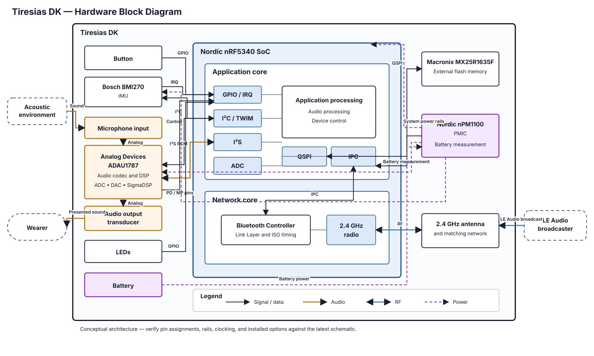

# Tiresias DK — Hardware Block Diagram

This diagram describes the principal hardware components and physical interfaces of the
Tiresias hearing-aid prototype. It intentionally excludes firmware modules, state machines,
storage formats, and software protocols.

## Main hardware blocks

- **Nordic nRF5340 SoC:** Runs the application on the application core and Bluetooth radio
  control on the network core. Its hardware peripherals connect the SoC to the board.
- **ADAU1787:** Provides analog audio conversion, serial PCM audio, and configurable DSP.
- **Microphone input and audio output transducer:** Form the physical acoustic input and
  output paths of the hearing aid.
- **BMI270:** Provides inertial sensing over the shared I²C bus and signals events through a
  GPIO interrupt line.
- **MX25R1635F:** Provides external nonvolatile storage through QSPI.
- **nPM1100 and battery:** Supply the prototype and provide a battery-measurement signal to
  the nRF5340 ADC. Individual voltage rails are intentionally not expanded here.
- **Button and LEDs:** Provide direct local input and status indication through GPIO.
- **Antenna and matching network:** Connect the nRF5340 radio to the external LE Audio
  broadcaster.

## Interface conventions

- Solid arrows show signal, audio, data, or RF flow. Arrowheads indicate the dominant or
  permitted direction; double-headed arrows indicate bidirectional interfaces.
- Dashed arrows show power distribution rather than information flow.
- Connections to the application and network cores are simplified hardware ownership
  relationships, not firmware call paths.
- The I²C connection is shown as a shared bus used by both the BMI270 and ADAU1787.
- I²S is shown as bidirectional to cover codec playback and capture, even if a particular
  firmware configuration uses only one direction.

## Verification notes

Before treating this as an electrical reference, verify the following against the latest
Tiresias DK schematic and board devicetree:

- Exact microphone and output-transducer topology
- ADAU1787 master-clock source and clock direction
- BMI270 bus instance, interrupt line, and installed status
- PMIC voltage rails, enable signals, and battery-measurement circuit
- External-flash part number, QSPI wiring, and power domain
- Antenna, matching-network, and RF-test-point arrangement
