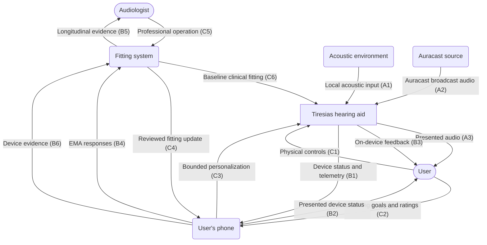
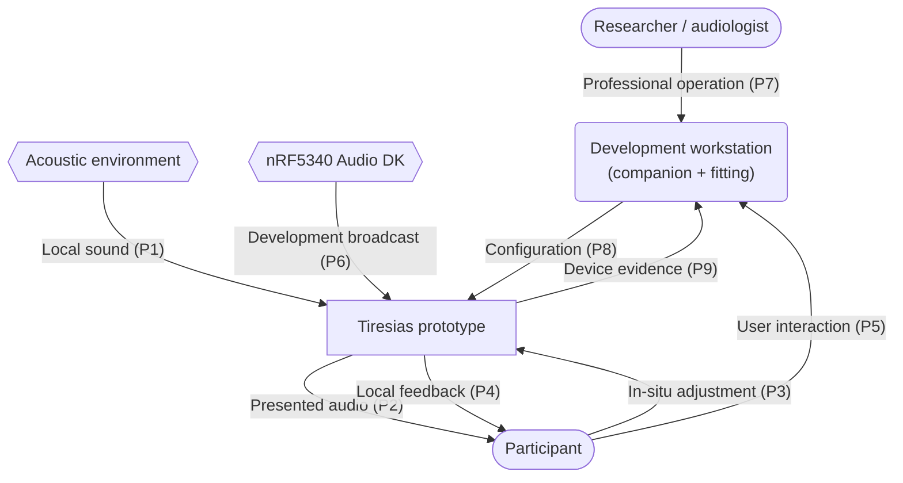

# Tiresias Hearing Aid — System Context

The two diagrams below separate the intended final system context from the simplified
research setup used during the proof-of-concept stage. Each diagram treats the Tiresias
hearing aid as a single system; its internal firmware and hardware structure belongs in
the block, organigram, and layered diagrams.

## Intended final system

In the intended system, the hearing aid participates in an Auracast ecosystem. The user's
phone provides the personal control and management interface, including broadcast
assistance, firmware updates, and in-situ personalization. A professional fitting system
provides the clinician-defined baseline and safe limits within which the wearer can make
adjustments in real listening situations.

Connection prefixes and colors identify the flow category: **A/red** for audio,
**B/blue** for information, telemetry, and EMA data, and **C/black** for control and
configuration.

### Elements

- **Tiresias hearing aid:** Processes local sound, receives Auracast audio, presents audio
  to the user, and exposes controlled configuration and monitoring interfaces.
- **User:** Uses the hearing aid and participates in personalization during real listening
  situations.
- **Acoustic environment:** Speech, music, noise, and other sounds captured locally by the
  hearing aid.
- **Auracast source:** A television, phone, venue transmitter, or other compliant broadcast
  audio source.
- **User's phone:** Runs the companion application and Broadcast Assistant, supports
  in-situ personalization, collects EMA responses, and relays fitting information.
- **Audiologist:** Establishes the clinical fitting and reviews longitudinal real-world
  evidence.
- **Fitting system:** Professional software and data services used for baseline fitting,
  safe adjustment limits, EMA and telemetry storage, and longitudinal review.

### Connections

- **Local acoustic input (A1):** The hearing aid captures sound from the acoustic
  environment.
- **Auracast broadcast audio (A2):** The hearing aid receives broadcasted LE Audio from an
  Auracast source.
- **Presented audio (A3):** The hearing aid delivers processed sound to the user.
- **Device status and telemetry (B1):** The hearing aid reports its state, active settings,
  adjustments, and contextual telemetry to the phone.
- **Presented device status (B2):** The phone presents relevant device and playback
  information to the user.
- **On-device feedback (B3):** The hearing aid gives audible or visual feedback
  directly to the user.
- **EMA responses (B4):** The phone sends the user's in-situ ratings and subjective reports
  to the fitting system.
- **Longitudinal evidence (B5):** The fitting system presents correlated EMA and device
  evidence to the audiologist for review.
- **Device evidence (B6):** The phone forwards settings, adjustments, and contextual
  telemetry to the fitting system so they can be correlated with EMA responses.
- **Physical controls (C1):** The user operates controls available directly on the hearing
  aid.
- **Listening goals and ratings (C2):** The user enters situational goals, ratings,
  preferences, and adjustment choices through the phone.
- **Bounded personalization (C3):** The phone sends user-selected adjustments that remain
  inside the clinician-defined safe envelope.
- **Reviewed fitting update (C4):** The fitting system sends clinician-reviewed fitting
  changes through the phone.
- **Professional operation (C5):** The audiologist operates the fitting system.
- **Baseline clinical fitting (C6):** The fitting system supplies the clinical baseline and
  safe personalization envelope directly to the hearing aid.

## Proof-of-concept research system

During the current PoC stage, an nRF5340 Audio DK provides an LE Audio broadcast. It is not
currently an Auracast implementation. The development workstation merges the roles of the
future companion application and professional fitting system. It is also the audiologist's
or researcher's primary interface to the prototype. The participant can provide immediate
input through the prototype's physical controls and report subjective outcomes during
real-world or controlled listening tasks.

### Elements

- **Tiresias prototype:** The hearing-aid development board and current firmware under
  investigation.
- **Participant:** Wears the prototype, makes in-situ adjustments, and reports perceived
  outcomes.
- **Acoustic environment:** A controlled test scene or a natural real-world listening
  situation.
- **nRF5340 Audio DK:** Provides the current LE Audio development broadcast; it is not yet
  an Auracast implementation.
- **Researcher / audiologist:** Configures the study and fitting and collects participant
  observations.
- **Development workstation:** Merges the roles assigned to the user's phone and the
  professional fitting system in the intended architecture. It provides fitting,
  experiment and device control, broadcast assistance, updates, data collection, and
  possible storage. Its double border and orange styling identify this PoC consolidation.

### Connections

- **Local sound (P1):** The prototype captures sound from the test or real-world
  environment.
- **Presented audio (P2):** The prototype delivers processed sound to the participant.
- **In-situ adjustment (P3):** The participant makes bounded adjustments with the
  prototype's controls.
- **Local feedback (P4):** The prototype indicates its status to the participant.
- **User interaction (P5):** The participant's listening goals, ratings, adjustment
  choices, and perceived outcomes are entered on or recorded by the workstation. Unlike
  the intended system, there is no separate companion application.
- **Development broadcast (P6):** The nRF5340 Audio DK supplies advertising, BASE, and BIS
  audio to the prototype.
- **Professional operation (P7):** The researcher or audiologist operates the workstation.
- **Configuration (P8):** In its combined fitting-system and companion roles, the
  workstation provides baseline fitting, adjustment limits, experiment setup, device
  control, broadcast assistance, and firmware updates.
- **Device evidence (P9):** The prototype reports applied adjustments, contextual
  telemetry, diagnostics, and experiment results.

## System boundary

In both diagrams, the **Tiresias hearing aid system** includes the Tiresias DK hardware,
nRF5340 firmware, ADAU1787 audio codec and DSP configuration, microphones, audio output
transducer, physical controls, indicators, and local power-management hardware.

People, phones, broadcast sources, workstations, development tools, and the acoustic
environment remain outside that boundary.

## Scope of this document

The diagrams describe relationships at the system boundary, not the protocols or internal
implementation used to realize them. The conceptual BLE control, codec-parameter, and
Broadcast Assistant boundaries are defined in
[control-link.md](control-link.md). Detailed security credentials, clinical fitting
workflow, telemetry storage, phone user experience, and the deployment transition from the
development broadcaster to an Auracast-compliant source remain subjects for later
refinement.

Both contexts distinguish the clinician-owned baseline fitting from wearer personalization.
The audiologist defines the prescription and a safe adjustment envelope; the wearer can
make reversible adjustments inside that envelope and report outcomes while experiencing
the relevant listening situation. Those observations can support later clinician review
and longitudinal personalization without giving the wearer unrestricted access to safety-
critical fitting parameters.
