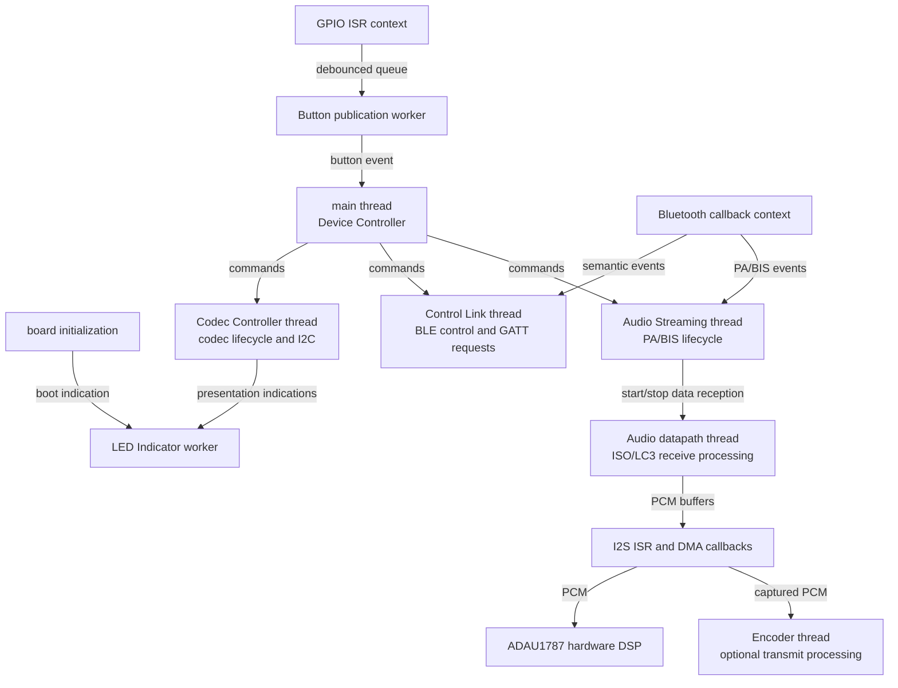

# Threads and Execution Contexts

## Purpose

This document defines where control-plane decisions and data-plane processing execute in
the Tiresias firmware. It complements the subsystem ownership model in
[control-plane.md](control-plane.md) and the message contracts in [zbus.md](zbus.md).

A **subsystem** is an ownership boundary. A **thread** is a scheduling and isolation
mechanism. The two concepts are intentionally separate: a subsystem does not receive a
thread merely because it owns a state machine, and a thread may support processing that is
not itself a control-plane subsystem.

Dedicated execution contexts are justified by one or more of the following requirements:

- blocking I/O or waits;
- independent latency or priority requirements;
- serialization of access to owned resources;
- isolation from unrelated failures or bursts of work; or
- a continuous data-processing loop.

Sleeping subsystem threads wait indefinitely for messages and therefore have negligible
CPU cost. Their principal costs are statically reserved stack RAM, kernel metadata,
subscriber queues, and the additional concurrency that must be reasoned about.

## Intended execution model



The arrows between control-plane contexts carry low-rate commands, events, results, and
state reports. ISO SDUs, LC3 frames, and PCM blocks use dedicated FIFOs and fixed buffers;
they do not pass through control-plane Zbus channels.

## Control-plane contexts

### Device Controller on the main thread

The Zephyr main thread is the intended execution context for the Device Controller
subsystem. After board initialization, `main()` publishes the explicit initial `START`
command and enters the Device Controller subscriber loop instead of returning.

Using the existing main thread:

- avoids allocating another stack for the supervisor;
- gives application startup and system lifecycle policy one owner;
- guarantees that the Device Controller begins dispatching only after required board
  initialization; and
- keeps the Device Controller implementation in its own module even though `main()`
  supplies its execution context.

The Device Controller must remain a supervisor. Its state handlers may coordinate commands
and results, but must not execute codec I2C transactions, Bluetooth procedures, LC3
processing, or continuous buffer movement.

### Codec Controller thread

The Codec Controller subsystem retains a dedicated thread. Codec reset, programming, and
parameter updates may perform blocking I2C operations. Keeping those operations in the
Codec Controller thread:

- serializes all access to the ADAU1787;
- prevents codec transactions from blocking Bluetooth lifecycle processing;
- keeps codec state and hardware effects under one owner; and
- permits Codec Controller stack and priority tuning independently from other subsystems.

The thread waits on the Codec Controller subscriber, dispatches the triggering channel to
the private state machine, and publishes state or result messages after processing.

### Control Link thread

The Control Link subsystem retains a dedicated thread. It owns the remote-management
session, protocol state, authorization, and request routing. The shared Bluetooth
Management module performs one-time stack initialization and physical advertising and
connection procedures; Control Link owns the policy that requests their availability. The
custom GATT service receives remote device and codec-configuration requests.

Bluetooth callbacks must not perform codec operations. A callback validates the minimum
framing, copies the request into an owned bounded queue, wakes the Control Link thread, and
returns. The Control Link thread parses the request, applies connection and authorization
policy, forwards a semantic command to the appropriate owner, and later sends the
correlated remote response. Transaction identifiers and bounded pending-operation storage
are required from the first modifying remote operation; an external client cannot rely on
the optimistic internal command-progress model.

Keeping this work separate prevents a burst of GATT operations from delaying PA or BIS
lifecycle events in the Audio Streaming subsystem.

Device-wide policy, such as changing audible presentation, is coordinated by the Device
Controller subsystem. Cataloged codec parameter operations use a dedicated queued request
and result port to the Codec Controller subsystem. In both cases, the behavior owner
performs final state and value validation. Codec Controller remains the only subsystem
that performs I2C access. V1 parameter values use ordered bounded messages; future bulk
transfers add a fixed buffer pool. Neither uses a latest-value Zbus channel.

The Control Link event loop records outstanding asynchronous work rather than blocking for
Codec Controller completion. This allows it to process disconnect, timeout, authorization,
and Bluetooth backpressure events while a codec transaction is active. The detailed
service and transfer design is in [control-link.md](control-link.md).

### Audio Streaming thread

The Audio Streaming subsystem retains a dedicated thread for LE Audio reception lifecycle
management. It processes scanning, periodic advertising synchronization, BASE selection,
BIG/BIS synchronization, streaming, and recovery events.

This thread does not decode LC3 or continuously process audio buffers. It only manages the
streaming state machine and starts, stops, or configures the associated data-plane workers.
Its separation from Control Link ensures remote-control work cannot delay synchronization
events and allows the two Bluetooth subsystems to evolve independently.

### Button Input contexts

Button Input spans two execution contexts:

1. The GPIO ISR identifies the button, applies the debounce policy, and writes an event to
   an ISR-safe queue without blocking.
2. The Button Input publication worker waits on that queue and publishes the semantic
   button event to Zbus in thread context.

The Device Controller subsystem interprets the event as device policy. Button Input does
not change another subsystem's state directly.

### LED Indicator context

The LED Indicator subsystem uses a low-priority worker that waits for indication commands
and performs GPIO operations. A timer callback may toggle LEDs for blinking, but it must
remain short and nonblocking.

The LED implementation may later use a work queue instead of a dedicated thread if that
reduces memory without compromising command ordering. This would not change the LED
Indicator subsystem boundary.

## Data-plane contexts

The data plane uses callbacks, dedicated worker threads, FIFOs, DMA buffers, and hardware
processing. Control-plane subsystem threads only control its lifecycle.

### BIS receive path

```text
Bluetooth controller / network core
    -> Bluetooth ISO callback
    -> dedicated ISO receive FIFO
    -> Audio datapath thread
    -> LC3 decoding and PCM buffering
    -> I2S ISR and DMA buffer exchange
    -> ADAU1787 DSP and analog output
```

The Bluetooth ISO callback copies the minimum information required to an available FIFO
block and returns. The Audio datapath thread consumes complete frames and performs the
software processing unsuitable for callback context. I2S DMA callbacks exchange fixed PCM
buffers without blocking. The ADAU1787 performs its configured signal processing in
hardware, outside an nRF5340 thread.

### Optional transmit path

When audio transmission is enabled, the I2S callback places captured PCM blocks into a
FIFO. The dedicated Encoder thread consumes complete frames, performs LC3 encoding, and
hands encoded frames to the Bluetooth transport. Encoding must not execute in the Codec
Controller, Audio Streaming, or I2S interrupt context.

### Other high-rate data

Future high-rate sensor or telemetry streams should use a dedicated queue or fixed buffer
and, when processing is nontrivial, a dedicated worker. Individual samples must not be
published as control-plane state messages.

## Callback, interrupt, and work-queue rules

| Context | Permitted work | Work to defer |
|---|---|---|
| GPIO or I2S ISR | Capture state, exchange fixed buffers, enqueue without blocking | Logging bursts, I2C, allocation, state-machine orchestration |
| Bluetooth callback | Validate, retain required references, copy/enqueue event, return | Codec access, long parsing, policy decisions, waiting for results |
| Subsystem thread | State transitions, command validation, owned blocking operations | Continuous audio processing owned by the data plane |
| Data-plane thread | FIFO waits, LC3 processing, PCM production or consumption | Device policy and unrelated peripheral operations |
| System workqueue | Short deferred cleanup, retry, or timer work | Long blocking operations and steady high-rate processing |
| Private workqueue | Serialized work with a dedicated stack and priority | Work belonging to a different subsystem owner |

Work items submitted without an explicit queue execute on Zephyr's shared system
workqueue. A long-running item there can delay unrelated kernel and application work. Use a
private workqueue or owning subsystem thread when work may block or has a distinct priority.

## Priority policy

Exact numeric priorities must be selected and verified for each build configuration. The
relative policy is:

1. Hardware interrupts and Bluetooth controller deadlines have the highest urgency.
2. Audio datapath workers must meet FIFO and presentation deadlines.
3. Audio Streaming lifecycle processing must respond promptly but does not process frames.
4. Codec Controller and Control Link operations are bounded control work.
5. Device policy, buttons, LEDs, telemetry, shell, and diagnostics are lower-rate work.

In Zephyr, lower numeric values represent higher preemptive priorities. Control-plane
threads should not unintentionally preempt the audio datapath for long periods. Blocking
operations must also avoid holding locks needed by a higher-priority data-plane context.

## Stack and queue sizing

Thread stacks and subscriber queues are statically reserved RAM. The current PoC values
are conservative initial allocations, not proof that every eventual handler fits.

Before release:

- measure stack high-water marks under initialization, reconnection, recovery, and maximum
  logging load;
- retain safety margin for deeper Bluetooth and driver call paths;
- size subscriber queues for the maximum event burst, not only steady-state traffic;
- use queued messages for requests that must not be overwritten; and
- confirm that callbacks never wait for a subsystem response.

Sleeping threads do not create meaningful CPU load. Consolidating threads should therefore
be driven by measured RAM pressure or simpler synchronization, not by thread count alone.

The first control-plane implementation intentionally omits per-destination outstanding
commands, command/result correlation, stale-result detection, deadlines, bounded retries,
and escalation policies. These reliability guardrails are future work after the lifecycle
flow is validated; [zbus.md](zbus.md) defines the staged delivery policy.

## Implementation status

The initial local-audio and BIS-reception control path now uses the new subsystem
execution contexts. The legacy source files remain in the repository for reference but
are excluded from the application target.

| Execution context | Status |
|---|---|
| Main thread | Runs the Device Controller subscriber loop. |
| Codec Controller thread | Owns ADAU1787 initialization, mode selection, state, and presentation indication. |
| Control Link thread | Owns connectable-advertising policy, ACL lifecycle state, and LED 1 indication; the custom service and request flow remain specified in [control-link.md](control-link.md). |
| Audio Streaming thread | Owns Bluetooth initialization and the broadcast discovery, synchronization, and recovery lifecycle. |
| Legacy `controller`, `audio_control`, and `bluetooth` sources | Retained only as reference and excluded from the application target. |
| Audio datapath and encoder threads | Retain as data-plane workers. |
| Button publication and LED workers | Retain unless a measured reason favors an equivalent work-queue design. |

Zephyr also creates kernel-owned contexts such as the idle thread, system workqueue, and
enabled Bluetooth, logging, shell, and management threads. The network-core image owns the
Bluetooth controller contexts. Their exact stacks and priorities are build-configuration
details and should be inspected in the generated configuration and thread-analyzer output.
